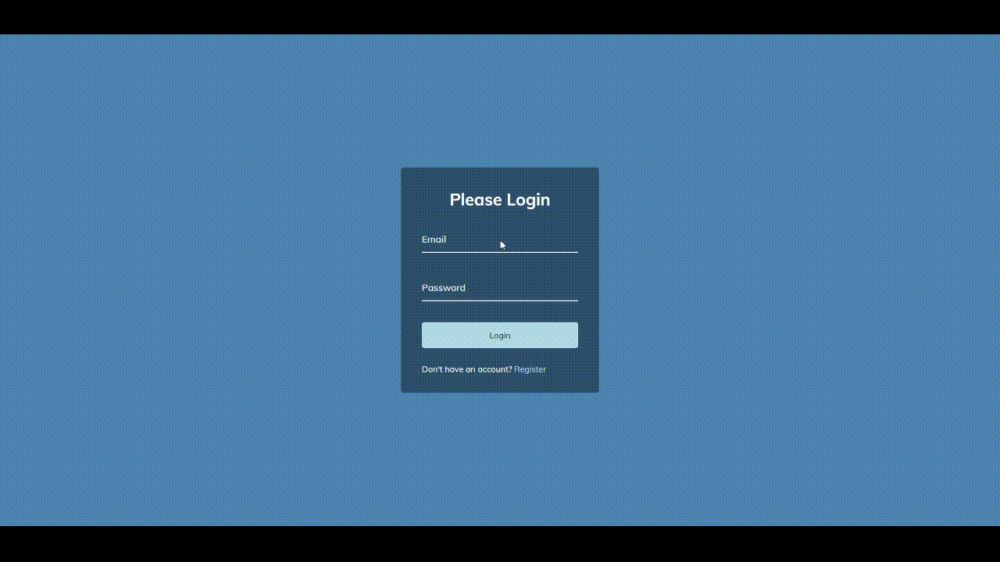

# Form Wave Animation

## 🚀 Overview

This project demonstrates the "Form Wave Animation" effect, where form fields animate in a wave-like pattern, enhancing user interaction and providing a visually appealing experience.

### 🎯 Project Goals:
- Style form elements to create a wave animation effect.
- Utilize CSS keyframes and animations for smooth transitions.
- Implement JavaScript to handle user interactions and trigger animations.
- Ensure responsiveness and cross-browser compatibility for a seamless experience.

## 🛠️ Built With

- [HTML5](https://www.w3schools.com/html/)
- [CSS3](https://www.w3schools.com/css/)
- [JavaScript](https://www.w3schools.com/js/)
